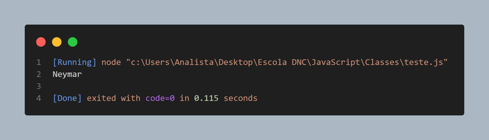

# Classes em JavaScript

Classes são um conjunto de objeto distintos com as mesmas caracteristicas.

Um dos metôdos possíveis para construção de classe é:

```javascript
const Jogador = function(nome, posicao, numGols) {
    Nome = nome,
    Posicao = posicao,
    Gols = numGols

    this.getNome = function() {
        return Nome
    }
    
    this.getPosicao = function() {
        return Posicao
    }
    
    this.getGol = function() {
        return Gols
    }
    
    
}

// Instânciando a classe:

const Neymar = new Jogador("Neymar", "Atacante", 450)
```

Saída:



#

### Com as novas atualizações temos uma nova maneira de criar classes:

```javascript
class Jogador {
    
    constructor(nome, posicao, numGols) {
        this.nome = nome,
        this.posicao = posicao,
        this.numGol = numGols
    }

    golsMarcados() {
        console.log
    }
}
```

Saída: 


